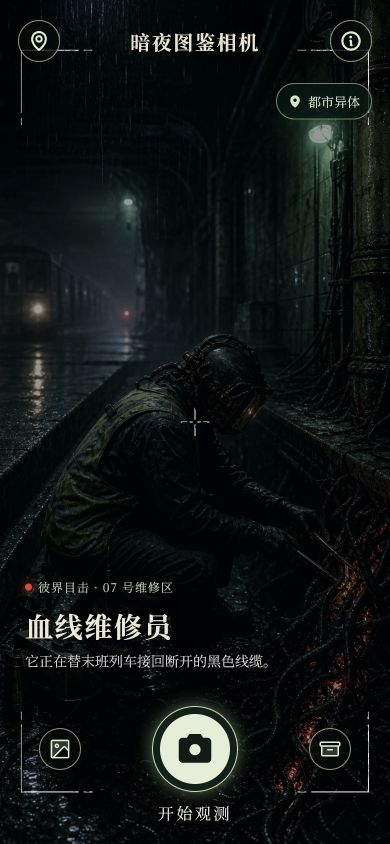
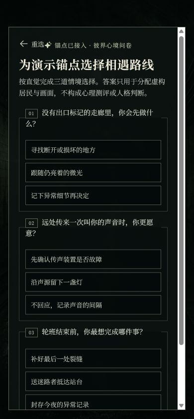
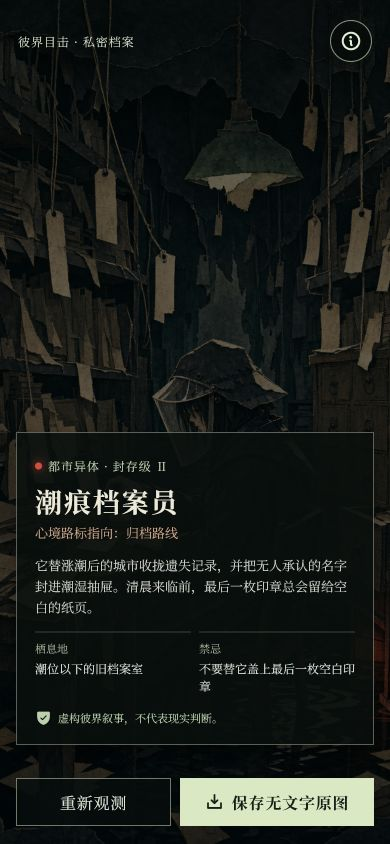
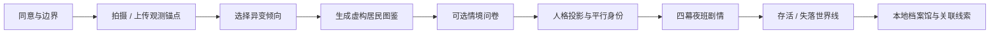

# 暗夜图鉴相机 · Dark Night Catalog

> 将一张经同意的照片，作为通往平行异界的观测锚点。

[](https://github.com/ZS881/dark-night-catalog/actions/workflows/quality.yml)


**暗夜图鉴相机**是一款移动优先的互动叙事原型。它不会评价真实人物的外貌或人格；用户的自愿照片仅用于建立一个本地、短暂的“观测锚点”。真正被呈现的是另一个世界里仍在上班、值夜、修补秩序的普通人型居民，以及玩家可进入的多分支夜班故事。

<p align="center">
  
  
  
</p>

## 体验闭环



## 为什么它不同

| 维度 | 设计选择 |
| --- | --- |
| 真实用户 | 照片是自愿的视觉锚点，而非面容评分或人格判断依据。 |
| 异界居民 | 图鉴中的角色是人型、日常、可工作的人；恐怖感来自世界规则而不是羞辱真人。 |
| 问卷系统 | 16 题情境问卷映射到娱乐性的 MBTI 风格“人格投影”，结果始终标注为非诊断。 |
| 剧情系统 | 每名居民拥有可回放的四幕夜班章节，选择会积累为可解释的存活或失落结局。 |
| 探索系统 | 本地世界线档案、道具变体、关系线与第二夜线索形成可持续探索的循环。 |

## 核心功能

- **观测图鉴**：上传或拍摄经同意的照片，选择雾、骨、鳞、菌、影、火等虚构倾向后获得居民档案。
- **人格投影**：16 道多权重情境题组成独立的可选玩法；不从照片、外貌或行为推断 MBTI。
- **夜班模式**：16 位异界居民对应数据驱动的四幕分支剧情，每幕提供三项行动与可追溯的后果。
- **世界线档案馆**：保存本地的虚构道具、返还/失落状态、居民关系和下一夜钩子。
- **纯图导出**：图鉴叙事与原始视觉导出分离，便于保存无文字的虚构角色图片。

## 设计原则

1. **虚构先于判断**：作品塑造角色和世界，而不是把真实用户变成被评价对象。
2. **同意先于观测**：上传前明确同意；原型只在当前浏览器会话使用图片。
3. **诡异而非贬损**：恐怖来自灯光、职业、空间与规则的错位，不使用羞辱性标签。
4. **后果可理解**：每个结局都回溯玩家的选择及其在世界规则中的影响。

## 快速开始

```bash
git clone https://github.com/ZS881/dark-night-catalog.git
cd dark-night-catalog/app
pnpm install
pnpm dev
```

生产构建：

```bash
cd app
pnpm build
```

## 仓库地图

```text
.
├── app/                         # Vite + React 原型
│   ├── public/assets/            # 图鉴与剧情视觉资产
│   └── src/
│       ├── App.jsx               # 主体验与路由状态
│       ├── mbti*.js              # 问卷、投影档案、深度报告
│       ├── nightChapters.js      # 四幕夜班剧情数据
│       └── worldArchive.js       # 本地世界线档案
├── assets/                       # 原始氛围素材备份
├── docs/                         # 产品、架构、安全与部署文档
└── .github/                      # CI、Issue 与 PR 规范
```

## 文档索引

- [产品与体验系统](docs/product-system.md)
- [技术架构](docs/architecture.md)
- [世界观与叙事框架](docs/world-bible.md)
- [内容安全与隐私边界](docs/content-safety.md)
- [构建与部署说明](docs/deployment.md)
- [参与贡献](CONTRIBUTING.md)

## 当前状态与路线图

- [x] 移动优先的观测、图鉴、问卷、档案馆与夜班流程
- [x] 16 个数据驱动的人格投影居民与分支剧情
- [x] 本地档案持久化与纯图导出
- [x] GitHub Actions 前端构建门禁
- [ ] 真实图像生成服务与失败兜底策略
- [ ] 可选的账号体系与跨设备世界线同步
- [ ] 主题周、协作图鉴与世界观创作工具

## 贡献与许可

欢迎通过 Issue 或 Pull Request 提出玩法、叙事和体验改进。参与前请阅读 [贡献指南](CONTRIBUTING.md) 与[内容安全边界](docs/content-safety.md)。

本仓库当前**未授予开源许可证**；代码与美术资产默认保留全部权利。
