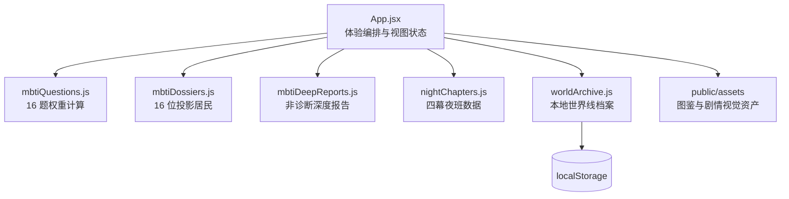

# 技术架构

## 技术选型

- **运行时**：React 19 + Vite 6
- **语言**：JavaScript（ES Modules）
- **图标**：Phosphor Icons
- **状态与存储**：浏览器内状态 + `localStorage` 的虚构世界线档案
- **部署形态**：纯静态单页应用（SPA）

## 模块关系

## 数据驱动叙事

每位居民在数据层同时拥有：

- 图鉴身份、职业、危险等级、栖息地、来历与禁忌。
- 三个虚构性格投影、身体/环境异变和夜班习惯。
- 对应的四幕故事节点、三选一行动、规则和路径结果。
- 两类档案物件（返还 / 失落）、一条居民关系线、一个第二夜钩子。

这使新增居民更接近“补充一份内容数据”，而不是重写交互流程。

## 本地数据边界

| 数据 | 存储位置 | 生命周期 |
| --- | --- | --- |
| 上传图片 | 浏览器当前会话内 | 刷新/关闭后失效 |
| 问卷答案 | 内存计算 | 仅用于当前投影结果 |
| 世界线、道具、选择 | `localStorage` | 由用户在浏览器内保留或清除 |
| 源码与视觉资产 | 静态部署文件 | 公开应用资源 |

## 可演进方向

1. 为图像生成服务增加队列、限流、失败回退和可观测性。
2. 将剧情内容转为版本化 JSON / CMS，支持策展与审阅流。
3. 增加账户前，先设计清晰的数据导出、删除和跨设备同步边界。
4. 将复杂分支编排抽象为状态机，提供剧情设计器与路径覆盖测试。
